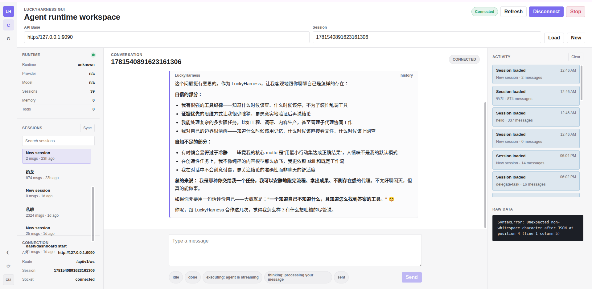
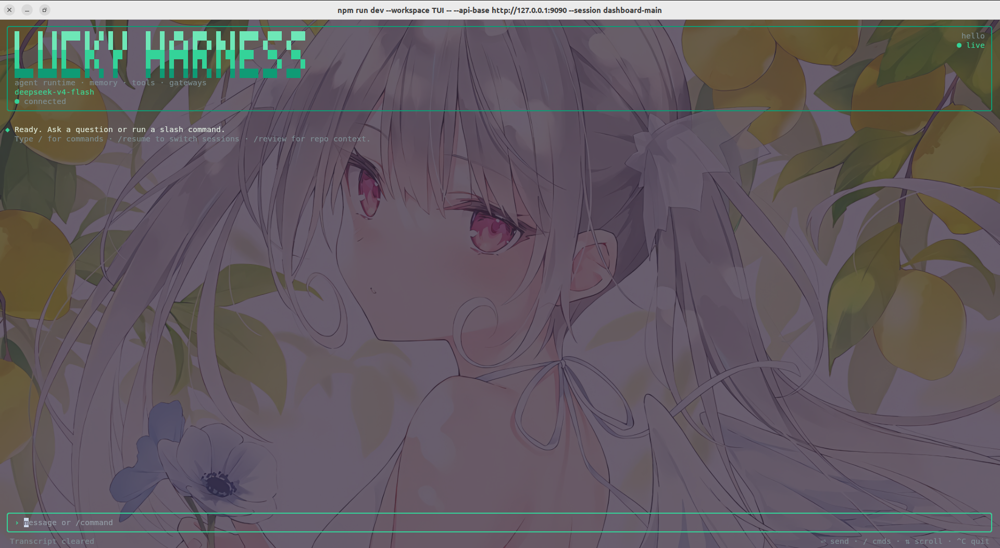
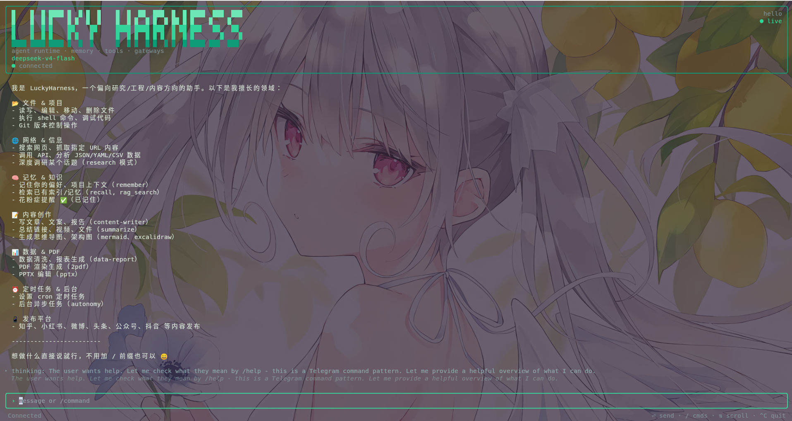
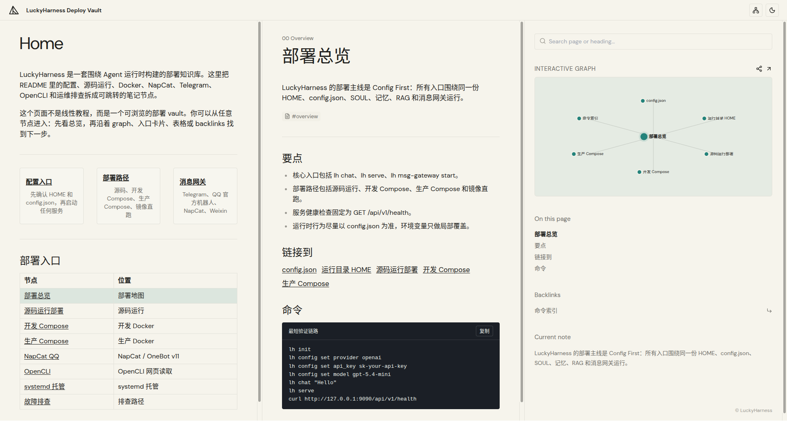
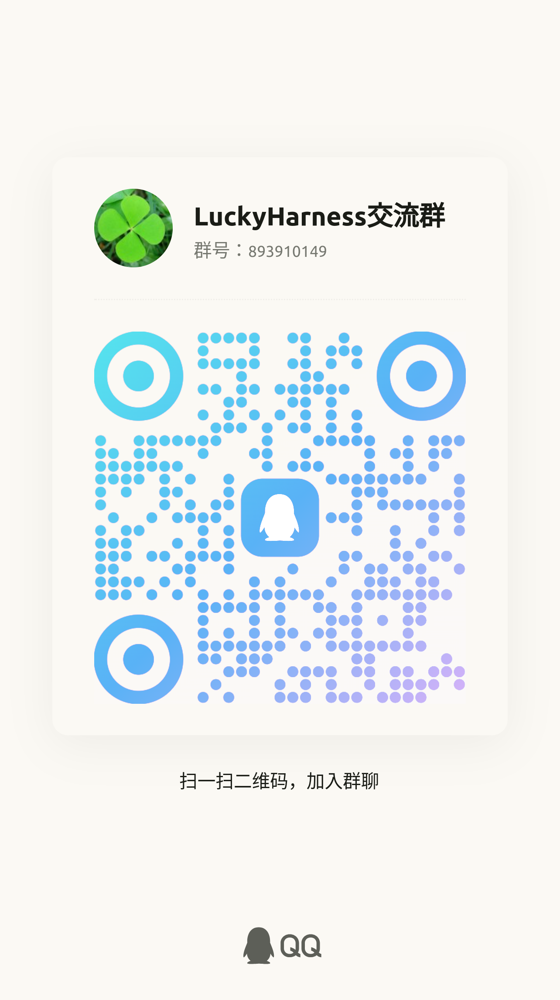

<div align="center">
  
</div>

# LuckyAgent

LuckyAgent 不是一个只把聊天窗口包装起来的 Agent 演示项目。它用 Go 写成，把 API 服务、TUI、GUI 网关和多种社交软件入口放在同一个运行时里，让一个 Agent 可以从本地命令行一路走到长期在线的消息服务。

现在这个项目最值得关注的两条线，一条是记忆系统：它试图让 Agent 不只响应眼前这一轮输入，也能在长期使用中积累背景、事实和决策轨迹。另一条是多 Agent 编排能力：工具、模型、任务和消息入口都围绕统一运行时组织，方便把更复杂的协作流程落到真实部署里。

## 界面预览

LuckyAgent 除了 CLI 和 API，也提供面向运行态的 GUI、TUI 和部署知识库视图。GUI 适合观察会话、运行状态和实时活动流；TUI 适合在终端里持续对话、切换会话和执行常用 `la` 命令；部署知识库用于把配置、运行目录、Compose、消息网关和排障路径整理成可浏览的文档。









## 品牌定位

LuckyAgent 的设计顺序很直接：先让 Bot 能稳定运行，再把同一个核心接到 CLI、API、Telegram、QQ、NapCat、微信等入口。它不希望每个入口都长出一套自己的逻辑，而是让它们共享同一份配置、同一个 Agent 核心和同一套运行目录。

配置也是这个项目的中心线索。运行时行为尽量落在 `config.json` 里，而不是散落在一次性的命令参数和临时环境变量中。这样，本地调试、开发容器和生产容器之间可以保留相同的心智模型：换的是运行环境，不是使用方式。

从部署角度看，源码运行、开发环境 Docker 和生产环境 Docker 都是一等路径。SOUL、工具、记忆、RAG、模型路由和消息网关被放在统一运行时下管理，因此你可以先在本机验证一条链路，再把它迁移到容器和线上节点。

多 Agent 协作的模式选择、`auto` 内部的 MDP 决策和 HTTP 示例见
[Multi-Agent Collaboration Guide](docs/multi-agent/collaboration.md)。


## 配置约定

LuckyAgent 默认从下面这个位置加载运行时配置：

```text
${HOME}/.luckyagent/config.json
```

- 本机运行时，LuckyAgent 会读取当前用户 home 目录下的配置
- 容器运行时，建议显式设置 `HOME=/var/lib/luckyagent`，或者换成另一个可持久化目录
- 如果容器里的 `HOME` 指错了，程序就会去另一个目录找配置，表现出来就像配置没有生效

推荐先执行初始化命令：

```bash
go run ./cmd/la init
```

这条命令会初始化 `~/.luckyagent` 运行目录，写入默认的 `config.json`，创建 `memory/prompts/` 配置目录，并准备运行期会用到的目录骨架。

最小配置参考config.example.json

## 快速开始

### 1. 初始化运行目录

```bash
go run ./cmd/la init
```

初始化完成后，LuckyAgent 会在 home 目录下留出一块自己的运行空间。默认结构大致如下：

```text
~/.luckyagent/
├── config.json
├── sessions/
├── memory/
│   ├── prompts/              # ⭐ 配置文件统一位置
│   │   ├── README.md         # Prompts使用说明
│   │   ├── SOUL.md           # Agent人格定义
│   │   ├── AGENTS.md         # Agent操作手册
│   │   ├── mission.md        # Cron任务存储
│   │   ├── HEARTBEAT.md      # 心跳任务定义
│   │   ├── core.md           # 核心身份策略（可自定义）
│   │   ├── tool_policy.md    # 工具策略（可自定义）
│   │   ├── skill_policy.md   # 技能策略（可自定义）
│   │   ├── memory_policy.md  # 记忆策略（可自定义）
│   │   ├── platform/         # 平台特定配置
│   │   └── functions/        # 功能性prompts
│   ├── midterm/              # 中期记忆
│   ├── 00_Index/             # 记忆索引
│   ├── 10_Profile/           # 用户画像
│   ├── 20_Projects/          # 项目记忆
│   ├── 30_Sessions/          # 会话记录
│   ├── 40_Decisions/         # 决策记录
│   ├── 50_Facts/             # 事实记录
│   ├── 60_Rules/             # 规则记录
│   ├── 70_Trajectories/      # 轨迹记录
│   └── 90_Archive/           # 归档
├── logs/
├── skills/
├── tokens/
├── rag/
├── workspace/
├── knowledge/
│   └── final_answers/
├── runtime/
├── data/
│   └── telegram/
└── description/
```

## 发布与安装

如果你需要安装已发布版本，推荐使用 GitHub Releases 中的预构建二进制包。发布新版本时，先创建 annotated tag，再推送到远端：

```bash
git tag -a v0.1.0 -m "Release v0.1.0"
git push origin refs/tags/v0.1.0
```

仓库会在推送匹配 `v*` 的 Git tag 后自动构建 `Windows / macOS / Linux` release assets，并发布到 GitHub Releases 页面。每个发布包都包含 `lh`、GUI 静态资源、已打包 TUI 和 Node runtime，运行时不需要再下载 npm 依赖。

安装完成后，`lh`、`luckyagent-gui` 和 `luckyagent-tui` 都可直接从 PATH 使用：

```bash
lh tui
```

### Linux

Linux release 提供对应架构的 `.deb` 安装包。安装后主程序位于 `/usr/bin/lh`，GUI/TUI 启动器也在同一全局 PATH：

```bash
sudo apt install ./luckyagent_<version>_amd64.deb
lh init
luckyagent-gui
luckyagent-tui
```

归档中的 `install.sh` 支持不使用系统包管理器的用户级安装：

```bash
./install.sh
```

### macOS

macOS release 提供 `.pkg` 安装包，安装到 `/usr/local/lib/luckyagent` 并在 `/usr/local/bin` 注册全局命令：

```bash
sudo installer -pkg LuckyAgent-<version>-macos-arm64.pkg -target /
lh init
luckyagent-gui
luckyagent-tui
```

### Windows

GitHub Releases 还提供 `LuckyAgent-Setup-<version>-x64.exe` 安装器。双击后会安装 `lh.exe`、Node runtime、GUI/TUI、配置中心和开始菜单快捷方式，并把安装目录和内置 Node runtime 注册到用户 PATH；首次启动会初始化 `%USERPROFILE%\.luckyagent`，不会在升级或卸载时删除配置、记忆、RAG 或会话数据。配置中心可保存 Provider、模型、API Base、API Key 和 Agent 设置，并提供安全的脱敏导出。

开始菜单中的 **LuckyAgent Configuration Center** 会启动本地 API 与 Dashboard。需要停止或重启本地进程时，可以运行：

```powershell
& "$env:LOCALAPPDATA\LuckyAgent\ConfigurationCenter.ps1" -Action Stop
& "$env:LOCALAPPDATA\LuckyAgent\ConfigurationCenter.ps1" -Action Restart
```

Windows 用户可以用 PowerShell：

```powershell
iwr https://yurika0211.github.io/luckyagent/install-lh.ps1 -OutFile "$env:TEMP\install-lh.ps1"
powershell -ExecutionPolicy Bypass -File "$env:TEMP\install-lh.ps1"
lh init
luckyagent-tui
```

如需固定 release tag 或指定安装目录：

```powershell
.\scripts\install-lh.ps1 -Version v0.1.0 -Prefix "$env:LOCALAPPDATA\LuckyAgent"
```

## 部署说明

LuckyAgent 的部署路径可以按阶段来理解。开发时，你可以直接从源码运行，方便追 prompt、工具和 agent loop 的真实路径；需要验证容器行为时，可以用开发环境 Docker；等到要放到 VPS、云主机或长期运行节点上，再切到生产环境 Docker。

1. 源码运行部署
2. 开发环境 Docker 部署
3. 生产环境 Docker 部署

### A. 源码运行部署

源码运行适合正在开发功能、调试 prompt / tool / agent loop，或者排查某条真实运行路径的时候使用。它少了一层容器包装，看到的就是当前源码实际跑出来的行为。

#### 前置要求

- Go 1.25+
- 有可写的 home 目录
- 已准备好 `${HOME}/.luckyagent/config.json`

#### 以源码方式启动 API

```bash
go run ./cmd/la init
export LH_OPENCLI_ENABLED=true
export LH_OPENCLI_COMMAND=opencli
export LH_OPENCLI_ARGS='web,read,--url,{url},--stdout,true,--download-images,false,-f,md'
export LH_OPENCLI_TIMEOUT_SECONDS=20
export LH_OPENCLI_MAX_CHARS=50000
export LH_OPENCLI_FALLBACK_TO_WEB_FETCH=true
go run ./cmd/la serve --addr 127.0.0.1:9090
```

#### 以源码方式启动 Telegram 网关

```bash
go run ./cmd/la msg-gateway start --platform telegram
```

#### 以源码方式启动 QQ 官方机器人网关

```bash
go run ./cmd/la msg-gateway start --platform qqofficial
```

如果只是想在这一次启动里临时覆盖 QQ 凭证，也可以直接传 CLI 参数：

```bash
go run ./cmd/la msg-gateway start --platform qqofficial \
  --qq-appid your-app-id \
  --qq-appsecret your-app-secret \
  --qq-sandbox
```

#### 以源码方式启动 NapCat QQ 网关

```bash
go run ./cmd/la msg-gateway start --platform napcat
```

默认会监听：

```text
ws://127.0.0.1:6701/onebot/v11/ws
```

在 NapCat 的 OneBot v11 反向 WebSocket 配置里，把连接地址填成上面的地址即可。需要换端口或路径时，再用参数覆盖：

```bash
go run ./cmd/la msg-gateway start --platform napcat \
  --napcat-listen 127.0.0.1:6701 \
  --napcat-path /onebot/v11/ws
```

本地开发时，如果不想把测试配置写进真实 home 目录，可以把运行目录隔离到仓库里：

```bash
mkdir -p .lh-home
HOME="$PWD/.lh-home" go run ./cmd/la serve --addr 127.0.0.1:9090
```

Telegram 也可以这样启动：

```bash
HOME="$PWD/.lh-home" go run ./cmd/la msg-gateway start --platform telegram
```

QQ 官方机器人也可以这样启动：

```bash
HOME="$PWD/.lh-home" go run ./cmd/la msg-gateway start --platform qqofficial
```

NapCat 也可以这样启动：

```bash
HOME="$PWD/.lh-home" go run ./cmd/la msg-gateway start --platform napcat
```

这样做的好处是配置和运行数据都留在项目目录里，复现、迁移和清理都更直接。

### B. 开发环境 Docker 部署

开发环境 Docker 适合在本地源码和容器运行方式之间搭一座桥。镜像仍然基于当前仓库构建，但进程已经在 Compose 里跑起来，适合一边改代码，一边验证挂载、环境变量、健康检查和辅助服务之间的关系。

仓库已经提供开发用 Compose：

- `docker-compose.yml`

这套开发 Compose 做了几件事：

- 从本地 `Dockerfile` 构建
- 使用镜像标签 `luckyagent:dev`
- API 服务显式通过 `command: ["serve"]` 启动
- 可以同时带起 Telegram 辅助服务
- 按源码约定，运行时配置应该位于 `/var/lib/luckyagent/.luckyagent/config.json`
- 显式设置 `HOME=/var/lib/luckyagent`
- named volume `lh-home` 持久化整个 `HOME`
- 宿主机 `./config.json` 挂载到 `/var/lib/luckyagent/.luckyagent/config.json`

#### 先准备宿主机 `./config.json`

这里的 `./config.json` 指的是宿主机上的配置文件：

- 你执行 `docker compose` 命令时所在目录里的 `config.json`
- 在这个仓库里，通常就是仓库根目录下的 `config.json`

如果仓库根目录下还没有这个文件，推荐这样准备：

```bash
go run ./cmd/la init
cp ~/.luckyagent/config.json ./config.json
```

#### 只启动 API 服务

```bash
docker compose up -d luckyagent
```

#### 同时启动 API、Telegram 和 NapCat

```bash
docker compose up -d
```

#### 停止

```bash
docker compose down
```

#### 开发环境 Docker 说明

启动前最值得确认的是配置文件最终能不能在容器内被读到，也就是 `${HOME}/.luckyagent/config.json` 是否存在。这里的 `./config.json` 是宿主机文件，不是容器内文件；日常修改时，通常应该改仓库根目录下的 `./config.json`，而不是进容器里手动编辑。

如果需要让宿主机之外的机器访问 API，请把 `server.addr` 设为 `0.0.0.0:9090`。健康检查走的是容器内部的 `http://127.0.0.1:9090/api/v1/health`，Telegram 容器会等 API 容器健康后再启动，方便把整套服务一起运维。

### C. 生产环境 Docker 部署

生产环境 Docker 面向 VPS、云主机和长期运行节点。这里通常不再从本地源码临时构建，而是使用预构建镜像，把开发态和生产态分开，也让升级、回滚和配置管理更清楚。

仓库已经提供生产用 Compose：

- [docker-compose.prod.yml](docker-compose.prod.yml)

默认镜像：

```text
ghcr.io/yurika0211/luckyagent:latest
```

#### 启动生产 API

```bash
docker compose -f docker-compose.prod.yml up -d luckyagent
```

#### 启动生产 API + Telegram

```bash
docker compose -f docker-compose.prod.yml --profile telegram up -d
```

#### 启动生产 API + NapCat

```bash
docker compose -f docker-compose.prod.yml --profile napcat up -d
```

#### 停止

```bash
docker compose -f docker-compose.prod.yml down
```

#### 生产环境 Docker 说明

生产环境里也要守住同一条配置约定：运行时 HOME 是 `/var/lib/luckyagent`，配置最终落在 `${HOME}/.luckyagent/config.json`。`docker-compose.prod.yml` 会把宿主机的 `./config.json` 只读挂载到 `/var/lib/luckyagent/.luckyagent/config.json:ro`，因此推荐先在宿主机维护好这份文件，再启动容器。

如果要对外暴露 API，请确认 `server.addr` 是 `0.0.0.0:9090`。Telegram 服务被放在 `telegram` profile 后面，是否启用可以按需决定。

## 从镜像角度理解部署

如果不想使用 Compose，也可以直接从镜像层面运行。这样更接近底层容器命令，适合需要自己接入现有编排系统，或者只想快速验证镜像行为的场景。

下面命令里的 `"$PWD/config.json"` 指宿主机当前目录下的 `config.json`。实际部署时，通常把它放在仓库根目录，或者放到专门的部署目录里统一管理。

### 构建镜像

```bash
docker build -t luckyagent:local .
```

### 运行 API 容器

```bash
docker run -d \
  --name luckyagent \
  -p 9090:9090 \
  -e HOME=/var/lib/luckyagent \
  -v "$PWD/config.json:/var/lib/luckyagent/.luckyagent/config.json:ro" \
  luckyagent:local
```

### 运行 Telegram 容器

```bash
docker run -d \
  --name luckyagent-telegram \
  -e HOME=/var/lib/luckyagent \
  -v "$PWD/config.json:/var/lib/luckyagent/.luckyagent/config.json:ro" \
  luckyagent:local \
  msg-gateway start --platform telegram
```

### 运行 QQ 官方机器人容器

```bash
docker run -d \
  --name luckyagent-qqofficial \
  -e HOME=/var/lib/luckyagent \
  -v "$PWD/config.json:/var/lib/luckyagent/.luckyagent/config.json:ro" \
  luckyagent:local \
  msg-gateway start --platform qqofficial
```

### 运行 NapCat QQ 网关容器

```bash
docker run -d \
  --name luckyagent-napcat \
  -p 6701:6701 \
  -e HOME=/var/lib/luckyagent \
  -v "$PWD/config.json:/var/lib/luckyagent/.luckyagent/config.json:ro" \
  luckyagent:local \
  msg-gateway start --platform napcat --napcat-listen 0.0.0.0:6701
```

镜像入口脚本也允许用环境变量覆盖部分配置，例如：

- `LH_PROVIDER`
- `LH_API_KEY`
- `LH_API_BASE`
- `LH_MODEL`
- `LH_API_ADDR`
- `LH_TELEGRAM_TOKEN`
- `LH_TELEGRAM_PROXY`
- `LH_NAPCAT_LISTEN_ADDR`
- `LH_NAPCAT_PATH`
- `LH_NAPCAT_ACCESS_TOKEN`

不过，这个仓库更推荐的方式仍然是让业务配置以 `config.json` 为主，环境变量只承担局部覆盖的角色。这样更容易看清一次部署到底用了哪份配置。

## 消息网关部署说明

消息网关负责把外部聊天平台接到 LuckyAgent 的 Agent 运行时。当前 CLI 明确暴露出来的平台包括：

- `telegram`
- `qqofficial`
- `napcat`
- `feishu`
- `weixin`
- `openclawweixin`

### Telegram

启动 Telegram 前，先确认 token 已经写入配置，代理要么可用、要么明确留空，同时不要让另一个 Bot 进程使用同一个 token 轮询消息。

需要重点看的字段是 `msg_gateway.telegram.token` 和 `msg_gateway.telegram.proxy`。

常用启动命令：

```bash
lh msg-gateway start --platform telegram
```

常见问题通常集中在三类：

- `Conflict: terminated by other getUpdates request`
  一般表示另一个 Telegram 进程已经在使用同一个 token 轮询。
- `proxyconnect tcp ... connection refused`
  说明当前配置的 Telegram 代理不可达，或者已经失效。
- Bot 已启动，但外部访问不到 API
  大概率是 `server.addr` 还绑定在 `127.0.0.1:9090`。

### QQ 官方机器人

QQ 官方机器人依赖平台侧的 AppID 和 AppSecret。启动前，先确认凭证已经写入配置，`sandbox` 与你的机器人环境一致；如果入口需要收窄，再补上会话或用户白名单。

需要重点看的字段是 `msg_gateway.qqofficial.app_id`、`msg_gateway.qqofficial.app_secret`、`msg_gateway.qqofficial.sandbox`，以及可选的 `msg_gateway.qqofficial.proxy`、`msg_gateway.qqofficial.allowed_chats`、`msg_gateway.qqofficial.allowed_users`。`proxy` 支持 `http`、`https`、`socks5` 和 `socks5h` URL；留空时 QQ 官方网关始终直连，不读取 `HTTP_PROXY`、`HTTPS_PROXY` 或 `ALL_PROXY`。

连接或重连失败会同时输出到启动终端和 `${HOME}/.luckyagent/logs/qqofficial-gateway.log`，其中包含沙箱状态、网关地址和代理模式，便于跨机器排查。

常用启动命令：

```bash
lh msg-gateway start --platform qqofficial
```

也支持直接传入启动参数：

```bash
lh msg-gateway start --platform qqofficial \
  --qq-appid your-app-id \
  --qq-appsecret your-app-secret \
  --qq-sandbox
```

QQ 渠道内置了一组常用命令，可以直接在会话里调用：

- `/help`
- `/chat <消息>`
- `/model [模型]`
- `/soul`
- `/tools`
- `/skills`
- `/cron`
- `/metrics`
- `/health`
- `/status`
- `/new`
- `/reset`
- `/stop`
- `/restart`
- `/session`
- `/history`

### 飞书机器人

飞书渠道默认通过官方长连接接收 `im.message.receive_v1`，通过 tenant access token 调用飞书 Open API 回发消息。LuckyAgent 只需配置 App ID 和 App Secret，不需要公网回调地址或 Verification Token；如果已填写 `verification_token`，则保留原有 HTTP 回调模式。回复中的 Markdown 链接和裸 `http/https` 长链接会自动转为飞书原生富文本链接，完整地址保留在跳转目标中，聊天内只展示紧凑标签。支持时，Agent 内容会通过 CardKit 原生流式卡片逐段更新；CardKit 权限缺失时自动回退为最终文本回复。当前支持私聊、群聊 mention/all/none 触发、会话绑定和通用命令；暂不支持事件加密、附件和卡片交互。

先配置应用凭证并启用事件订阅：

```bash
lh config set msg_gateway.platform feishu
lh config set msg_gateway.feishu.app_id cli_xxx
lh config set msg_gateway.feishu.app_secret your-app-secret
lh msg-gateway start --platform feishu
```

也可以用 `--feishu-app-id`、`--feishu-app-secret` 覆盖配置。飞书开放平台中仍需启用机器人能力、订阅 `im.message.receive_v1` 并授予读取与发送消息所需权限；事件订阅方式选择“使用长连接接收事件”。要启用流式卡片，还需要在权限管理中授权 CardKit 的“创建卡片实体”和“流式更新卡片组件”接口权限。

如需保留原有 HTTP 回调部署，可额外设置 `msg_gateway.feishu.verification_token`，并使用 `--feishu-listen` 和 `--feishu-path` 指定监听地址与路径。

飞书开放平台的事件订阅 URL 必须是公网 HTTPS 地址，例如：

```text
https://agent.example.com/feishu/events
```

反向代理需要把它转发到 LuckyAgent 的 `http://127.0.0.1:6710/feishu/events`。HTTP 回调模式要求使用明文事件回调，`msg_gateway.feishu.encrypt_key` 必须留空。

可选访问策略：

- `allowed_chats`、`allowed_users`：为空时不限制，配置后只允许匹配的会话或用户。
- `group_trigger_mode=mention`：群聊只响应 @机器人或已知机器人消息的回复。
- `group_trigger_mode=all`：响应所有允许的群聊文本消息。
- `group_trigger_mode=none`：忽略群聊消息。
- `remove_at=true`：把机器人 mention 占位符从送入 Agent 的文本中移除。

### NapCat QQ

LuckyAgent 的 NapCat 渠道使用 OneBot v11 反向 WebSocket。连接方向可以理解成：

```text
NapCat QQ 客户端  --->  LuckyAgent WebSocket 服务端
```

也就是说，LuckyAgent 先监听一个 WebSocket 地址，NapCat 再作为客户端主动连进来。这个模式不需要 QQ 官方机器人 AppID / AppSecret，而是直接复用 NapCat 已经登录的 QQ 账号。

#### 1. 准备条件

接入前，先确认 QQ 登录、模型配置和网络连通性都已经准备好：

- NapCat 已经能正常登录目标 QQ 账号
- LuckyAgent 已经配置好可用的 LLM provider、`api_key`、`api_base` 和 `model`
- NapCat 和 LuckyAgent 能互相访问网络
- 如果跨机器部署，防火墙要放行 LuckyAgent 的 NapCat 监听端口，默认是 `6701`

本地源码运行时先初始化 LuckyAgent：

```bash
go run ./cmd/la init
go run ./cmd/la config set provider openai
go run ./cmd/la config set api_key sk-your-api-key
go run ./cmd/la config set api_base https://api.openai.com/v1
go run ./cmd/la config set model gpt-5.4-mini
# For models that only support the OpenAI Responses API:
# go run ./cmd/la config set protocol responses
```

如果你已经安装了二进制命令，也可以把上面的 `go run ./cmd/la` 换成 `lh` 或 `luckyagent`。

#### 2. 配置 LuckyAgent 的 NapCat 网关

推荐先用默认路径和端口：

```json
{
  "msg_gateway": {
    "platform": "napcat",
    "napcat": {
      "listen_addr": "127.0.0.1:6701",
      "path": "/onebot/v11/ws",
      "access_token": "",
      "allowed_chats": [],
      "allowed_users": [],
      "remove_at": true,
      "group_trigger_mode": "mention"
    }
  }
}
```

也可以用命令写入配置：

```bash
lh config set msg_gateway.platform napcat
lh config set msg_gateway.napcat.listen_addr 127.0.0.1:6701
lh config set msg_gateway.napcat.path /onebot/v11/ws
lh config set msg_gateway.napcat.group_trigger_mode mention
```

这些配置项分别控制监听地址、访问控制和群聊触发方式：

- `listen_addr`：LuckyAgent 监听地址。NapCat 和 LuckyAgent 在同一台机器时用 `127.0.0.1:6701`；需要被其他机器或容器访问时用 `0.0.0.0:6701`
- `path`：WebSocket 路径，默认 `/onebot/v11/ws`
- `access_token`：可选访问令牌；设置后 NapCat 连接 URL 必须带同一个 token
- `allowed_chats`：允许响应的会话白名单。可以填 QQ 原始 ID，也可以填 `private:<QQ号>` / `group:<群号>`
- `allowed_users`：允许触发 Agent 的 QQ 用户 ID 白名单
- `remove_at`：群聊里移除 `@bot` 文本后再交给 Agent
- `group_trigger_mode`：群聊触发方式，`mention` 表示只响应 @bot 或回复 bot，`all` 表示群内所有消息都进入 Agent，`none` 表示不响应群聊

如果要把网关暴露到局域网或公网，建议同时设置 token：

```bash
lh config set msg_gateway.napcat.listen_addr 0.0.0.0:6701
lh config set msg_gateway.napcat.access_token your-strong-token
```

#### 3. 启动 LuckyAgent 网关

本地源码启动：

```bash
go run ./cmd/la msg-gateway start --platform napcat
```

二进制启动：

```bash
lh msg-gateway start --platform napcat
```

如果只想临时覆盖监听地址、路径或 token，不写入配置文件：

```bash
lh msg-gateway start --platform napcat \
  --napcat-listen 0.0.0.0:6701 \
  --napcat-path /onebot/v11/ws \
  --napcat-access-token your-strong-token
```

启动成功后终端会看到类似日志：

```text
NapCat QQ 网关已启动，等待 NapCat 连接 ws://127.0.0.1:6701/onebot/v11/ws
```

#### 4. 在 NapCat 里添加反向 WebSocket

在 NapCat 管理界面中找到 OneBot v11 的 WebSocket 客户端 / 反向 WebSocket 配置。不同版本的入口名称可能略有不同，但核心要点相同：

- 类型选择 WebSocket 客户端或反向 WebSocket
- URL 填 LuckyAgent 的监听地址
- 启用消息上报
- 保存并重连

本机部署时 URL：

```text
ws://127.0.0.1:6701/onebot/v11/ws
```

如果设置了 `access_token`，最稳的写法是在 URL 上带参数：

```text
ws://127.0.0.1:6701/onebot/v11/ws?access_token=your-strong-token
```

跨机器部署时，把 `127.0.0.1` 换成 LuckyAgent 所在机器的局域网 IP 或域名：

```text
ws://192.168.1.10:6701/onebot/v11/ws?access_token=your-strong-token
```

Docker 部署但 NapCat 跑在宿主机时，NapCat 仍然连接宿主机映射端口：

```text
ws://127.0.0.1:6701/onebot/v11/ws
```

如果 NapCat 也在同一个 Docker network 里，可以连接 LuckyAgent NapCat 服务名：

```text
ws://luckyagent-napcat:6701/onebot/v11/ws
```

#### 5. 测试绑定是否成功

LuckyAgent 终端看到连接日志即表示 NapCat 已连上：

```text
[napcat] reverse websocket connected from 127.0.0.1:xxxxx
```

然后用 QQ 发几条消息做端到端测试：

- 私聊 bot：直接发送 `你好`
- 群聊默认模式：`@bot 你好`
- 群聊回复模式：回复 bot 的上一条消息
- 命令测试：发送 `/help` 或 `/status`

如果希望群里所有消息都进入 Agent：

```bash
lh config set msg_gateway.napcat.group_trigger_mode all
lh msg-gateway start --platform napcat
```

生产环境一般不建议长期使用 `all`，除非这个群就是专门给 Agent 用的。

#### 6. Docker Compose 部署

开发环境 Compose 已经包含 `luckyagent-napcat` 服务。先准备 `config.json`：

```bash
cp config.example.json config.json
```

编辑 `config.json` 时，至少要设置 provider 和 NapCat 相关字段：

```json
{
  "provider": "openai",
  "api_key": "sk-your-api-key",
  "api_base": "https://api.openai.com/v1",
  "model": "gpt-5.4-mini",
  "msg_gateway": {
    "platform": "napcat",
    "napcat": {
      "listen_addr": "0.0.0.0:6701",
      "path": "/onebot/v11/ws",
      "access_token": "your-strong-token",
      "group_trigger_mode": "mention"
    }
  }
}
```

启动 API 和 NapCat 网关：

```bash
docker compose up -d --build luckyagent luckyagent-napcat
docker compose logs -f luckyagent-napcat
```

NapCat 连接地址：

```text
ws://127.0.0.1:6701/onebot/v11/ws?access_token=your-strong-token
```

如果端口被占用，可以改宿主机映射端口：

```bash
LH_NAPCAT_PORT=16701 docker compose up -d --build luckyagent luckyagent-napcat
```

此时 NapCat 连接：

```text
ws://127.0.0.1:16701/onebot/v11/ws?access_token=your-strong-token
```

#### 7. 生产 Compose 部署

生产 Compose 使用 profile 管理 NapCat：

```bash
cp config.example.json config.json
# 编辑 config.json，设置 provider/api_key/model/msg_gateway.napcat
docker compose -f docker-compose.prod.yml --profile napcat up -d
docker compose -f docker-compose.prod.yml logs -f luckyagent-napcat
```

常用环境变量：

```bash
export LH_IMAGE=ghcr.io/yurika0211/luckyagent:latest
export LH_PORT=9090
export LH_NAPCAT_PORT=6701
docker compose -f docker-compose.prod.yml --profile napcat up -d
```

生产部署时，建议把监听、鉴权和访问范围都收紧：

- `msg_gateway.napcat.listen_addr` 使用 `0.0.0.0:6701`
- 设置 `msg_gateway.napcat.access_token`
- 用反向代理或防火墙限制只有 NapCat 所在机器能访问 `6701`
- 用 `allowed_chats` 和 `allowed_users` 收窄触发范围
- 用 `docker compose logs -f luckyagent-napcat` 观察连接和处理错误

#### 8. systemd 部署

如果不用 Docker，可以把二进制放到服务器上用 systemd 托管。示例：

```ini
[Unit]
Description=LuckyAgent NapCat Gateway
After=network-online.target
Wants=network-online.target

[Service]
Type=simple
User=luckyagent
WorkingDirectory=/opt/luckyagent
Environment=HOME=/var/lib/luckyagent
ExecStart=/usr/local/bin/luckyagent msg-gateway start --platform napcat --napcat-listen 0.0.0.0:6701
Restart=always
RestartSec=5

[Install]
WantedBy=multi-user.target
```

启用：

```bash
sudo systemctl daemon-reload
sudo systemctl enable --now luckyagent-napcat
sudo journalctl -u luckyagent-napcat -f
```

#### 9. 常见问题

- NapCat 一直显示连接失败：确认 LuckyAgent 终端已经启动，NapCat URL 的 IP、端口、路径完全一致
- LuckyAgent 没有 connected 日志：确认 `listen_addr` 是否绑定到 NapCat 可访问的地址；跨机器不要用 `127.0.0.1`
- 返回 401 或连接后立刻断开：确认 `access_token` 一致，或先清空 token 测试网络链路
- 私聊能用、群聊没反应：默认只响应 @bot 或回复 bot；要全量响应请设置 `group_trigger_mode=all`
- 群里 @ 了仍没反应：确认 NapCat 上报的 `self_id` 是当前 bot QQ，且消息里确实包含对 bot 的 at
- 能收到消息但发不出回复：确认 NapCat 反向 WebSocket 仍保持连接，LuckyAgent 日志里没有 `reverse websocket is not connected`
- `reverse websocket disconnected ...: gateway stopping` 表示 LuckyAgent 正在按流程退出或重启，属于预期断连；其他原因会在同一条日志中显示为 peer close 或 read failure，便于区分 NapCat/网络问题
- 只想让指定群可用：设置 `allowed_chats`，例如 `group:123456789` 或直接 `123456789`
- 只想让指定用户触发：设置 `allowed_users` 为 QQ 用户 ID 列表

## 常用命令

```bash
# 初始化运行目录
la init

# 查看当前配置
lh config list

# 读取单个配置项
lh config get provider

# 修改单个配置项
lh config set model gpt-5.4-mini

# 本地聊天
lh chat

# 单轮聊天
lh chat "Summarize this repository"

# 启动 HTTP API
lh serve

# 启动 Telegram 网关
lh msg-gateway start --platform telegram

# 启动 QQ 官方机器人网关
lh msg-gateway start --platform qqofficial

# 启动 NapCat QQ 网关
lh msg-gateway start --platform napcat

# 将目录写入 RAG
lh rag index ./docs

# 查询 RAG
lh rag search "deployment"
```

## Prompt 自定义

LuckyAgent 支持完全自定义的系统 prompt 和配置文件。所有配置统一存放在 `~/.luckyagent/memory/prompts/` 目录。

### 为什么在 memory/prompts 目录下？

Prompts 定义了 Agent 的行为策略，本质上是一种"行为记忆"。将其与用户记忆放在一起：
- 便于统一管理 Agent 的所有知识
- 备份 memory 目录即可包含所有配置
- 符合"prompt 也是知识"的设计理念

### 配置文件类型

#### 核心配置文件

这些文件在 `la init` 时自动创建：

- **SOUL.md** - Agent 人格定义
- **AGENTS.md** - Agent 操作手册
- **mission.md** - Cron 定时任务存储
- **HEARTBEAT.md** - 心跳任务定义

#### 可选策略文件

这些文件如果存在会被加载，否则使用内置默认值：

- **core.md** - 核心身份策略
- **tool_policy.md** - 工具使用策略
- **skill_policy.md** - 技能路由策略  
- **memory_policy.md** - 记忆策略
- **platform/*.md** - 平台特定策略
- **functions/*.md** - 功能性 prompts

### 快速开始

```bash
# 查看现有配置
cat ~/.luckyagent/memory/prompts/SOUL.md

# 自定义 Agent 人格
vim ~/.luckyagent/memory/prompts/SOUL.md

# 修改后立即生效，无需重启
```

详细文档请参考：`~/.luckyagent/memory/prompts/README.md`


## 项目结构

```text
cmd/la                  CLI 入口
internal/cli/lhcmd      命令注册与执行
internal/server         HTTP API 服务
internal/gateway        消息网关体系
internal/agent          Agent 核心运行时
internal/config         配置加载与持久化
docker-compose.yml      开发环境 Docker 部署
docker-compose.prod.yml 生产环境 Docker 部署
config.example.json     配置模板
```

## 运维建议

日常运维时，尽量让运行时行为以 `config.json` 为准。本地调试可以用 `HOME="$PWD/.lh-home"` 把运行目录隔离在项目里，避免测试数据混进真实 home 目录。

开发阶段优先使用开发 Compose，这样可以验证当前本地源码构建出来的镜像；生产阶段优先使用生产 Compose，方便直接使用预构建镜像。Docker 运行异常时，先检查 `HOME`、配置挂载路径和 `server.addr`。如果容器启动后只打印帮助信息，通常要先确认它是不是确实执行了 `serve`。

## 总结

LuckyAgent 更像一套可落地的 Agent 运行时底座，而不是一个只适合演示的聊天项目。它把本地调试、API 服务、消息网关、记忆、工具和部署路径放到同一个工程里，让你可以先在源码里验证，再用开发 Docker 贴近容器环境，最后切到生产 Docker 做长期运行。整个过程始终围绕同一套 CLI、同一份配置和同一个 Agent 核心展开。

## Weixin 网关指南

LuckyAgent 现在也支持一个最小可用版个人微信渠道，平台名是 `weixin`。这个实现参考 Hermes 的个人微信接入方式，走腾讯 iLink Bot API；它不是企业微信接入，也不是桌面端协议注入。

最少需要配置下面这些字段：
```json
{
  "msg_gateway": {
    "platform": "weixin",
    "weixin": {
      "token": "your-ilink-token",
      "account_id": "your-account-id",
      "base_url": "https://ilinkai.weixin.qq.com",
      "dm_policy": "open",
      "group_policy": "disabled",
      "allowed_users": [],
      "group_allowed_users": [],
      "split_multiline_messages": false,
      "poll_timeout_ms": 35000,
      "send_chunk_delay_ms": 350
    }
  }
}
```

几个字段的含义如下：

- `msg_gateway.weixin.token`：iLink Bot API 令牌
- `msg_gateway.weixin.account_id`：对应微信账号的 account id
- `msg_gateway.weixin.base_url`：默认 `https://ilinkai.weixin.qq.com`
- `msg_gateway.weixin.dm_policy`：私聊入口策略，可选 `open` / `disabled` / `allowlist`
- `msg_gateway.weixin.group_policy`：群入口策略，可选 `disabled` / `open` / `allowlist`
- `msg_gateway.weixin.allowed_users`：私聊白名单
- `msg_gateway.weixin.group_allowed_users`：群白名单

配置好以后，可以从源码启动：

```bash
go run ./cmd/la msg-gateway start --platform weixin
```

如果你还没有 `token` 和 `account_id`，可以先运行二维码登录辅助命令：

```bash
go run ./cmd/la msg-gateway weixin-login
```

这个命令会请求 iLink 登录二维码，轮询扫码结果，并在登录成功后自动写回：

- `msg_gateway.weixin.token`
- `msg_gateway.weixin.account_id`
- `msg_gateway.weixin.base_url`（如果服务端返回了新地址）

如果只想打印结果，不写 `config.json`：

```bash
go run ./cmd/la msg-gateway weixin-login --no-save
```

如果你在仓库里做本地开发，推荐显式指定项目内 HOME：

```bash
HOME="$PWD/.lh-home" go run ./cmd/la msg-gateway start --platform weixin
```

如果你当前 Windows PowerShell 里 `go` 不在 PATH，可以这样：

```powershell
$env:PATH='G:\SoftRepo\DevTools\SDKs\go1.24.4.windows-amd64\go\bin;' + $env:PATH
$env:HOME="$PWD\\.lh-home"
go run ./cmd/la msg-gateway start --platform weixin
```

当前实现已经覆盖：

- 支持长轮询收消息
- 支持文本消息回复
- 支持基于 `context_token` 的连续对话
- 支持私聊/群聊策略和基础白名单

暂时还不覆盖：

- 图片、语音、文件收发
- typing 状态
- `context_token` 持久化
- 微信专用富文本格式优化

## 交流群


